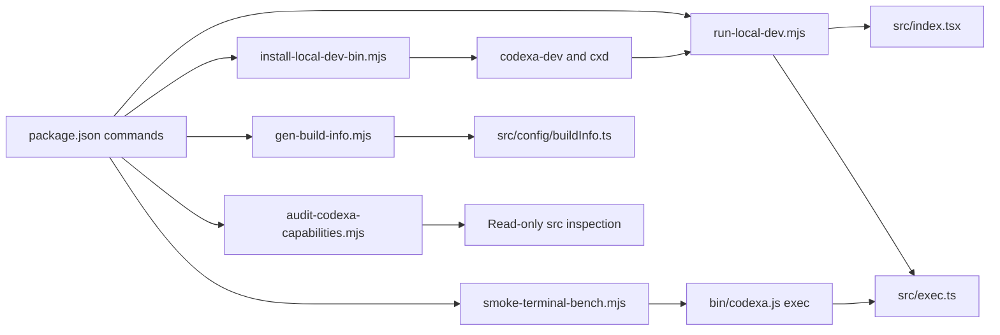
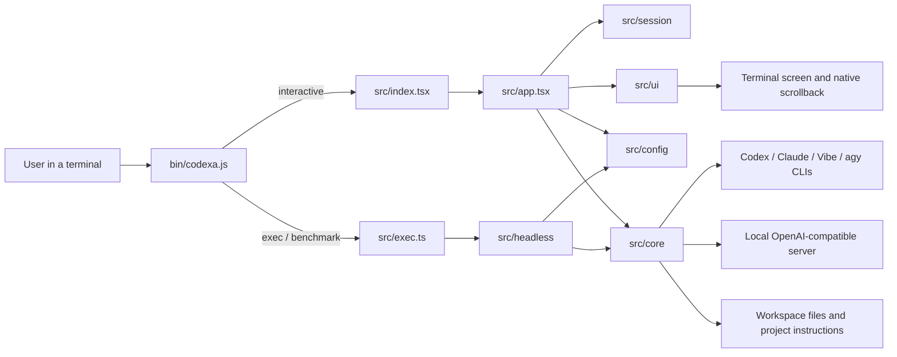
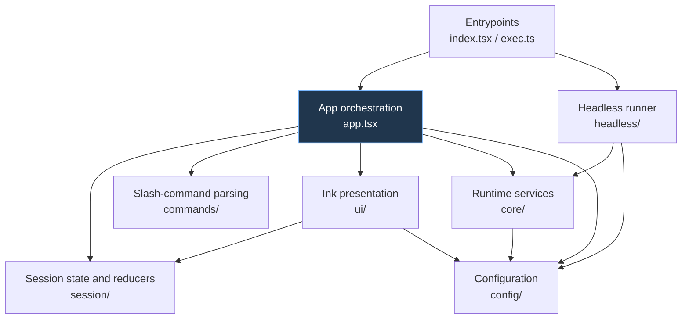
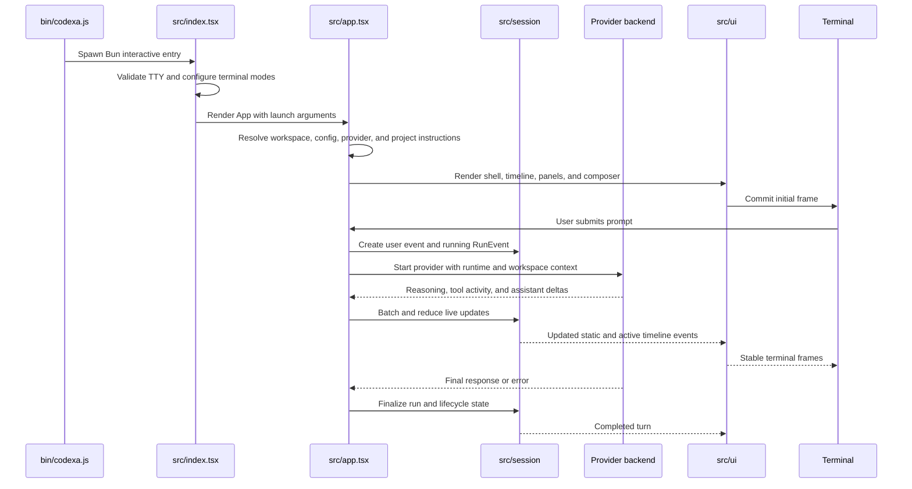
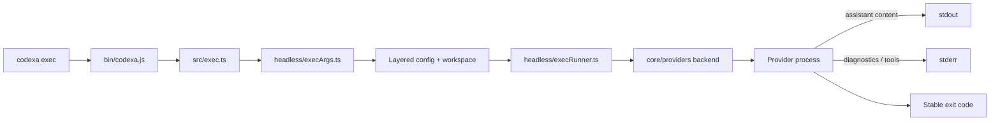
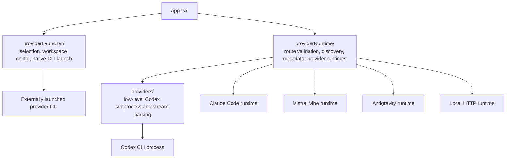
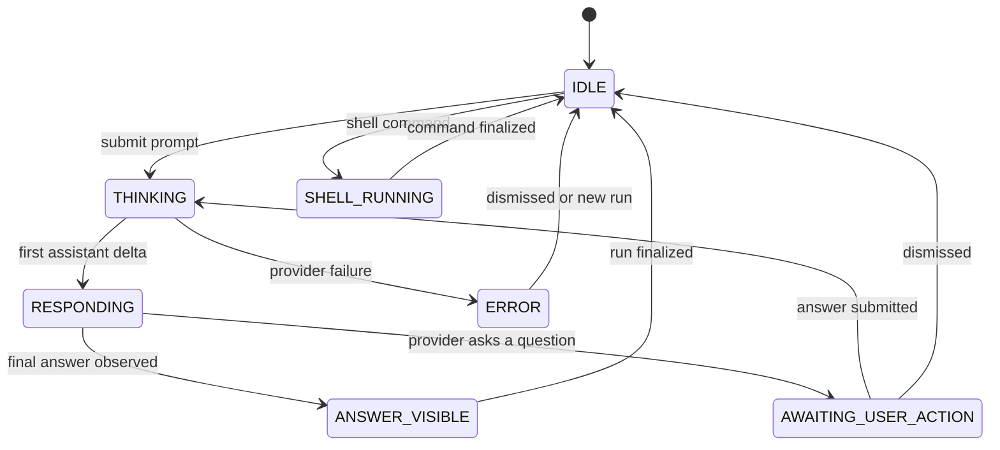
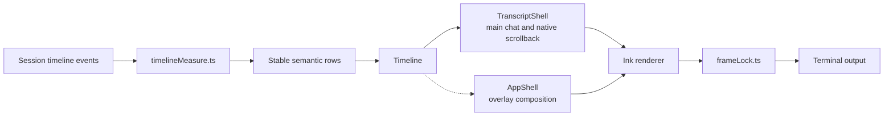
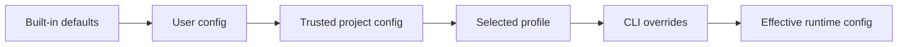

# Codexa Architecture

This document explains what Codexa does, how the application is assembled, how a prompt moves through the system, and which architectural boundaries maintainers must preserve. For the purpose and maintenance notes for every file under `src/`, see [Source Guide](SOURCE_GUIDE.md).

## What Codexa is

Codexa is a terminal user interface around coding-agent command-line tools. It gives those tools a shared workspace-oriented experience with:

- an Ink/React terminal UI with native terminal scrollback;
- interactive and headless execution modes;
- layered configuration and per-workspace provider selection;
- model, reasoning, permission, theme, and runtime controls;
- streamed reasoning, tool activity, file activity, and assistant output;
- workspace trust, project-instruction loading, file-activity tracking, and path guards;
- provider discovery and routing for Codex, Claude Code, Mistral Vibe, Antigravity, and local OpenAI-compatible servers.

Codexa does not replace provider authentication. External provider CLIs remain responsible for their own installation and sign-in state.

## Technology and runtime

| Area | Technology | Responsibility |
| --- | --- | --- |
| Launcher | Node.js ESM | Installed `codexa` command, argument dispatch, child-process environment, and terminal hand-off. |
| Application runtime | Bun + TypeScript | Executes the interactive or headless TypeScript entry point. |
| Terminal UI | Ink 7 + React 19 | Declarative terminal components, input, focus, panels, and rendering. |
| Provider integration | Child processes, JSON streams, HTTP | Runs provider CLIs, parses events, and talks to local OpenAI-compatible endpoints. |
| Configuration | TOML + JSON caches | Resolves defaults, user/project config, profiles, CLI overrides, settings, trust, and provider state. |
| Tests | Bun test | Colocated unit, reducer, parser, integration, and terminal-rendering contracts. |

## Developer automation

Repository scripts sit outside the application runtime and provide local launching, shim installation, build metadata, static capability auditing, and an authenticated headless smoke. Their full command and side-effect reference is the [Developer Scripts guide](../scripts/README.md).

Only build-info generation intentionally rewrites a tracked source file. The capability audit is read-only. The terminal smoke is an external integration command that inherits the caller's workspace and provider authentication, so it is not part of the default unit-test suite.

## System context

The launcher chooses a mode but does not own application state. `src/index.tsx` owns interactive startup and terminal cleanup. `src/exec.ts` owns the headless command surface. Both paths reuse configuration and backend services from `src/`.

## Major source boundaries

The intended ownership rules are:

- `app.tsx` coordinates subsystems. It may wire hooks, state, providers, commands, and screens, but reusable domain logic should move to the appropriate folder.
- `session/` owns serializable chat/timeline state, lifecycle reducers, streaming schedules, and plan flow. It must not render Ink components.
- `ui/` owns terminal presentation and input behavior. It consumes session/config types but should not launch providers or persist workspace state.
- `core/` owns non-UI runtime behavior: processes, providers, terminal control, workspace services, model discovery, and diagnostics.
- `config/` owns configuration parsing, defaults, persistence, trust, and effective runtime policy.
- `commands/` converts slash-command text into actions; `app.tsx` performs those actions.
- `headless/` adapts the shared backend contracts to stdout, stderr, and process exit codes without constructing the Ink UI.

## Interactive startup and prompt flow

Important details:

1. `src/index.tsx` wraps stdout with frame locking, configures terminal modes, installs resize and failure cleanup, and renders one `App` root.
2. `src/app.tsx` resolves the current workspace, layered runtime, provider route, model metadata, permissions, and project instructions.
3. A submission creates linked user/run events with stable `turnId` and `runId` values.
4. Provider callbacks are sanitized and batched by the live-render scheduler before entering the session reducer.
5. The UI derives rows from session events. It does not directly parse provider output.
6. Finalization flushes pending updates, records workspace activity, completes the run, and returns the UI lifecycle to an idle or awaiting-user state.

## Headless execution flow

Headless mode deliberately bypasses Ink, panels, and session rendering. It shares launch arguments, layered configuration, project-instruction loading, terminal sanitization, provider contracts, and Codex subprocess parsing with the interactive application.

## Provider architecture

Three similarly named folders represent different layers and must remain distinct.

| Layer | Owns | Must not pretend to own |
| --- | --- | --- |
| `providerLauncher/` | Provider picker records, per-workspace defaults/routes, command resolution, and inherited-terminal launches. | In-app response parsing or model capability semantics. |
| `providerRuntime/` | Provider availability, validation, model discovery, capability/context metadata, reasoning options, and routed execution. | Generic terminal rendering or persistent chat state. |
| `providers/` | Backend interface and low-level Codex subprocess/JSON/transcript handling. | Workspace provider-picker state. |

Provider truthfulness is an invariant: selectable routes must match actual `routeAvailable` and configuration state. A provider that can only be launched externally must not be presented as though Codexa can route an in-app conversation through it.

## Session and UI state

The session stores timeline events separately from the visual lifecycle state. Static events are completed transcript content; active events contain the currently changing run. `UIState` drives composer availability, activity styling, and action-required presentation.

Reducers in `session/` are the source of truth for lifecycle transitions and event reconciliation. UI components should derive presentation from state instead of maintaining a competing run lifecycle.

## Terminal rendering model

Codexa uses two terminal presentation modes:

- Main chat stays in the normal screen buffer. The intro, completed turns, and live output participate in native terminal scrollback.
- Modal/picker screens temporarily use overlay behavior and may enter alternate-screen mode. Returning to main chat restores the normal buffer.

The rendering pipeline is:

Maintenance invariants:

- The logo and completed conversation are transcript content and may scroll away; do not make them sticky to fix visibility.
- The composer and runtime/context status have one owner at the bottom of the live tail.
- `/clear` is an atomic state and frame-boundary reset, not an appended transcript message.
- Resize handling must preserve the last valid frame and avoid competing resize owners.
- All provider and shell text crosses terminal-sanitization boundaries before rendering.
- Terminal mode changes must have paired cleanup so crashes do not leave mouse, paste, cursor, title, or alternate-screen state behind.

## Configuration and persisted state

Runtime configuration uses explicit precedence, where each later layer wins:

Untrusted project configuration is reported but not applied. User settings, trust state, update caches, provider model caches, plans, attachments, and workspace provider state use the platform-specific Codexa data directory. Legacy project-local provider state may be read for migration, but new state must not dirty the user's project.

## Workspace and safety boundaries

- `workspaceRoot.ts` establishes the normalized workspace used throughout a run.
- `launchContext.ts` describes installed/dev launches and controlled workspace relaunches.
- `projectInstructions.ts` loads repository instructions with explicit status reporting.
- `workspaceGuard.ts` recognizes paths outside the workspace and dependency paths before commands or diagnostics are accepted.
- `workspaceActivity.ts` snapshots and diffs files so the timeline can report what a run changed.
- `appData.ts` centralizes platform-specific data paths; new persistent state should use it rather than inventing project-local folders.

## Maintenance playbooks

### Adding or changing a provider

1. Define or update its runtime and provider types.
2. Keep discovery, route configuration, route validation, and launch availability separate.
3. Register it in the runtime and launcher registries only for capabilities it actually supports.
4. Add executable resolution when an external CLI is involved.
5. Update model, reasoning, context, and capability metadata where applicable.
6. Test discovery, routing, persisted workspace migration, command arguments, and failure messages.
7. Update this document and the affected entries in the source guide.

### Adding a slash command or panel

1. Parse the command into a typed action in `commands/handler.ts` and expose discoverability through `ui/input/slashCommands.ts`.
2. Perform side effects in `app.tsx`; keep the parser deterministic.
3. Put new panels under `ui/panels/` and shared screen chrome under `ui/chrome/`.
4. Add keyboard/focus tests and small-terminal layout coverage when the screen changes row usage.

### Changing session or streaming behavior

1. Change event types and reducer logic together.
2. Preserve `turnId`, `runId`, and stream ordering contracts.
3. Keep live batching in `liveRenderScheduler.ts`; do not dispatch every provider byte directly into Ink.
4. Test partial chunks, final-response reconciliation, cancel/error paths, action ordering, and final-frame stability.

### Changing terminal rendering

1. Identify the single owner of the affected row or terminal mode.
2. Update measurement logic and rendering components together.
3. Test exact narrow/normal/tall dimensions, scroll anchoring, clear boundaries, and resize transitions.
4. Use env-gated debug instrumentation for diagnosis and perform a real terminal smoke test for claims about VTE, mouse, selection, or native scrollback.

### Adding configuration or persisted state

1. Add parsing, validation, defaults, serialization, and diagnostic source reporting.
2. Preserve configuration precedence and trust gating.
3. Store mutable application state through `core/workspace/appData.ts` unless the data is intentional project configuration.
4. Test invalid values, missing files, migration/fallback behavior, and round-trip persistence.

## Documentation maintenance

Update `docs/ARCHITECTURE.md` when a subsystem boundary, entry point, data flow, provider layer, persistence rule, or terminal invariant changes. Update `docs/SOURCE_GUIDE.md` whenever a file under `src/` is added, removed, renamed, or changes responsibility. Architectural descriptions must be verified against the current code rather than inferred from historical behavior or filenames.
